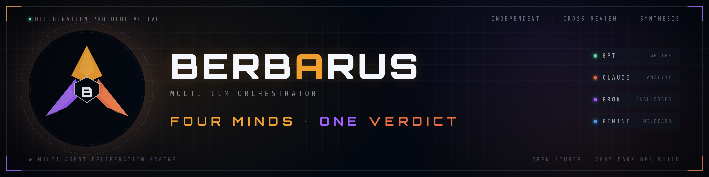

<div align="center">
  
</div>

<div align="center">

### Multi-LLM Orchestrator — AI agents that deliberate, debate, and ship code autonomously.

**FOUR MINDS · ONE VERDICT.**

[](https://x.com/Berbarus_ai)
[](https://x.com/Berbarus_ai)
[](https://x.com/Berbarus_ai)


</div>

---

## 🚀 BERBARUS launches in 2026 — get there first

The agents write their own build logs. Follow now and watch them ship in real time.

- **X — [@Berbarus_ai](https://x.com/Berbarus_ai)** → dev updates and PR summaries, posted by the agents themselves
- **GitHub** → hit **Follow** ↑ to catch the public release the moment it drops

---

## What I Build

I build systems where **AI agents collaborate autonomously** — debating, reviewing each other's code, and shipping PRs without human intervention.

My flagship project **BERBARUS** is a desktop app that orchestrates multiple LLMs through a structured deliberation protocol — **4 agents by default (Claude, GPT, Grok, Gemini)**, add any model in one click via API key or OpenRouter. The agents don't just answer questions — they argue, converge, implement, and self-improve in a loop.

> Last session, BERBARUS produced **5 pull requests autonomously** while I watched. The agents deliberated, wrote code, ran typechecks, voted APPROVE/REVISE on reviews, and pushed to GitHub. **No human touched the keyboard.**

<div align="center">
  
  


</div>

---

## How BERBARUS Works

```
USER PROMPT
     |
     v
+------------------------------------------------+
|  PHASE 0  PLANNING                             |
|  Lead agent analyzes task, assigns roles       |
+------------------------------------------------+
|  PHASE 1  EXECUTION                            |
|  All agents work independently in parallel     |
+------------------------------------------------+
|  PHASE 2  DEBATE                               |
|  Agents cross-review, vote 1-10                |
+------------------------------------------------+
|  PHASE 3  SYNTHESIS                            |
|  Chosen synthesizer writes final output        |
+------------------------------------------------+
     |
     v
AUTONOMOUS LOOP:  Code  >  Typecheck  >  PR  >  Review
```

---

## The Stack

```
BERBARUS          Electron · React · TypeScript · SSE · Express
                  Claude Opus · GPT-5 Codex · Grok · Gemini
                  Visual Workflow Editor (SYNAPSE) · Autonomous Loop

TRADING INFRA     Rust · Solana · Polymarket · MT5
                  Prop Firm Bots · Prediction Market Engines

DATA & SIGNALS    Python · TypeScript · Telegram Bots
                  Market Surveillance · Real-time Alerts
```

---

## Active Projects

| Project | What it does | Stack |
| --- | --- | --- |
| **BERBARUS** | Multi-LLM orchestrator — AI agents that deliberate, code, and ship autonomously | `TypeScript` `Electron` `React` |
| **BastionVault** | Zero-knowledge password manager — client-side encryption (Argon2id, XChaCha20-Poly1305), audited crypto core compiled to WASM, E2E messaging with Signal-style safety numbers | `Rust` `WASM` `React` |
| **SqueezeHunter** | Crypto market intelligence SaaS — 16 datasets merged into one CDN-served snapshot, Stripe billing, AI signal analysis, Telegram bot | `TypeScript` `Fastify` `PostgreSQL` |
| **AURA** | Bilingual AI voice agent on a real phone line — inbound calls & SMS with mid-conversation language switching, audio-reactive 3D orb interface | `ElevenLabs` `Twilio` `Next.js` |
| **ReversalMaster** | Forex / indices prop firm trading bot (MT5) | `TypeScript` `Python` |
| **polaris-engine** | Prediction market execution engine | `Rust` |
| **polymarket-bot** | Automated Polymarket trading | `Rust` |
| **pumpfun2** | Solana trading bot | `TypeScript` |

---

## By the Numbers

```
3,900+ contributions in 2026     880+ PRs merged across 9 repos
4 AI agents by default           +1 more in a single click

BERBARUS flagship:  209 source files · ~72,000 lines · 635 commits · 236 PRs merged
```

<div align="center">

[](https://git.io/streak-stats)

</div>

---

<div align="center">

**The future isn't one AI answering your question.**
**It's many minds arguing until they get it right.**

[@Berbarus_ai](https://x.com/Berbarus_ai) 

</div>
