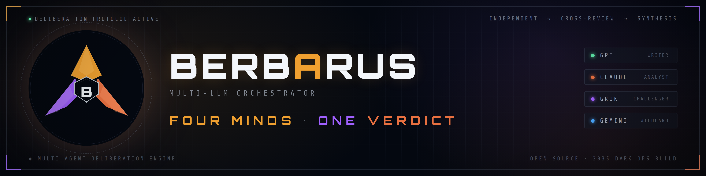

<div align="center">
  
</div>

<div align="center">

### Multi-LLM Orchestrator — AI agents that deliberate, debate, and ship code autonomously.

**FOUR MINDS · ONE VERDICT.**

[](https://x.com/Berbarus_ai)
[](https://x.com/Berbarus_ai)
[](https://x.com/Berbarus_ai)
[](https://github.com/only4bandz)


</div>

--- 


## 🚀 BERBARUS launches in 2026 get there first

The agents write their own build logs. Follow now and watch them ship in real time. 

- **X — [@Berbarus_ai](https://x.com/Berbarus_ai)** → dev updates and PR summaries, posted by the agents themselves
- **GitHub** → hit **Follow** ↑ to catch the public release the moment it drops

---

## What I Build 

I build systems where **AI agents collaborate autonomously** — debating, reviewing each other's code, and shipping PRs without human intervention.

My flagship project **BERBARUS** is a desktop app that orchestrates multiple LLMs through a structured deliberation protocol — **4 agents by default (Claude, GPT, Grok, Gemini)**, add any model in one click via API key or OpenRouter. The agents don't just answer questions — they argue, converge, implement, and self-improve in a loop.

> Last session, BERBARUS produced **5 pull requests autonomously** while I watched. The agents deliberated, wrote code, ran typechecks, voted APPROVE/REVISE on reviews, and pushed to GitHub. **No human touched the keyboard.**

<div align="center">
  
  


</div>

---

## How BERBARUS Works

```
USER PROMPT
     |
     v
+------------------------------------------------+
|  PHASE 0  PLANNING                             |
|  Lead agent analyzes task, assigns roles       |
+------------------------------------------------+
|  PHASE 1  EXECUTION                            |
|  All agents work independently in parallel     |
+------------------------------------------------+
|  PHASE 2  DEBATE                               |
|  Agents cross-review, vote 1-10                |
+------------------------------------------------+
|  PHASE 3  SYNTHESIS                            |
|  Chosen synthesizer writes final output        |
+------------------------------------------------+
     |
     v
AUTONOMOUS LOOP:  Code  >  Typecheck  >  PR  >  Review
```

---

## Products & Platforms

Beyond BERBARUS, I build AI products and practical software for creators, business operations, and market research — from the interface to the systems behind it.

| Project | What it does | Core technologies |
| --- | --- | --- |
| **BERBARUS** | Multi-LLM orchestrator — AI agents that deliberate, code, and ship autonomously | `TypeScript` `Electron` `React` |
| **[ClipCentral](https://www.clipcentral.ai)** | AI video studio that turns streams and VODs into vertical clips: transcription, captions, editorial kits, exports, scheduling, and Facebook publishing. Operated through the web app or MCP. | `Next.js` `TypeScript` `FFmpeg` `Whisper` `MCP` |
| **AURA** | Bilingual AI voice assistant for business calls and SMS, with appointment booking, caller requests, conversation history, and follow-up workflows. | `Next.js` `ElevenLabs` `Twilio` |
| **GeoLeads** | Geospatial B2B prospecting platform with business discovery, website enrichment, interactive maps, CRM workflows, and API/MCP access. | `Python` `FastAPI` `PostGIS` `MCP` |
| **[Serein](https://serein.chat)** | Bilingual AI wellness companion for everyday reflection, with persistent conversations and account data controls. | `Next.js` `TypeScript` `OpenRouter` `libSQL` |
| **Bastion** | Password manager with client-side encryption, a shared Rust/WASM core, a web vault, a browser extension, and encrypted note sharing. | `Rust` `WASM` `React` |
| **SqueezeHunter** | Crypto market intelligence dashboard combining whale movements, stablecoin flows, liquidity, and market structure. | `TypeScript` `Fastify` `Node.js` |
| **SYNAPSE** · pre-release | Visual AI workflow desktop app built on BERBARUS, with execution traces, approval gates, model comparison, and cost controls. | `Electron` `React` `TypeScript` |

---

## Business & Developer Tools

| Project | What it does | Core technologies |
| --- | --- | --- |
| **Website Factory** | Website production workspace with verified business briefs, AI-assisted generation, visual review, versioned artifacts, and static-site export. | `Next.js` `TypeScript` `Playwright` |
| **ScanFacture** | Mobile receipt organizer that turns photographed invoices into categorized PDF expense reports for sharing or email delivery. | `Next.js` `IndexedDB` `jsPDF` |
| **Google Ads Management** · in development | Multi-client dashboard for campaign reporting, geographic performance analysis, rule-based audits, and account synchronization. | `Next.js` `PostgreSQL` `Google Ads API` |
| **AI Calling Agent Bot** | Telegram and Discord tools for configuring bilingual phone agents, placing calls, and reviewing call reports using connected voice accounts. | `TypeScript` `ElevenLabs` `Twilio` |
| **Trace** | Text analysis workspace combining statistical signals and structured LLM assessments to investigate writing patterns and possible AI influence. | `Next.js` `TypeScript` `OpenRouter` |
| **AppForge** | AI-assisted mobile interface prototyping with conversational iteration, device previews, and HTML export. | `React` `TypeScript` `Vite` |
| **Photo1** | Local photo sourcing tool with batch downloads, previews, and author credits through the Unsplash, Pixabay, and Pexels APIs. | `Node.js` `JavaScript` |

---

## Research & Prototypes

### Commerce & Interactive Experiences

| Project | Focus | Core technologies |
| --- | --- | --- |
| **LaunchPilot** | Local commerce planning prototype for product research, unit economics, scenario analysis, and paid-test planning. | `Next.js` `TypeScript` |
| **TrendTrack Radar** | E-commerce research CLI that scores stores and advertising signals, tracks changes, and generates reports. | `Python` `TrendTrack API` |
| **DAYZERO** | Browser-based zombie survival FPS prototype with procedural terrain, weather, enemy AI, and survival mechanics. | `JavaScript` `Three.js` |

<details>
<summary><strong>Trading Systems & Market Research</strong></summary>

A collection of execution infrastructure, analysis tools, and research prototypes. Paper-trading and simulation projects are identified below.

| Project | Focus | Core technologies |
| --- | --- | --- |
| **MERIDIAN FX / ReversalMaster** | Forex research, backtesting, and MT5 trading workflows. | `Python` `MT5` |
| **BBwick** | MT5 strategy runtime, offline optimization, and demo-account execution tooling. | `TypeScript` `Python` `MT5` |
| **XAUUSD Structure Scanner** | Gold-market structure analysis and MT5 signal scanning. | `TypeScript` `MT5` |
| **Atlas** | Swing-trading research and strategy tooling. | `Python` |
| **ARC** | Prediction-market research and paper-trading experiments. | `Python` |
| **Datacenter** | Deterministic decision-engine and replay prototype using test fixtures. | `TypeScript` |
| **polaris-engine** | Prediction-market execution engine. | `Rust` |
| **polymarket-bot** | Automated Polymarket trading infrastructure. | `Rust` |
| **pumpfun2** | Solana trading bot. | `TypeScript` |

</details>

---

## The Stack

```
BERBARUS          Electron · React · TypeScript · SSE · Express
                  Claude Opus · GPT-5 Codex · Grok · Gemini
                  Visual Workflow Editor (SYNAPSE) · Autonomous Loop

AI & AUTOMATION   MCP · OpenRouter · ElevenLabs · Twilio
                  Agent workflows · Voice operations · Model orchestration

WEB & PRODUCTS    Next.js · React · TypeScript · Tailwind CSS
                  Dashboards · SaaS applications · Desktop tools

MEDIA & DATA      FFmpeg · Whisper · Python · FastAPI
                  Video pipelines · Geospatial discovery · Market research

STORAGE           PostgreSQL · PostGIS · SQLite / libSQL · Drizzle

SYSTEMS           Rust · WASM · MT5 · Solana
                  Encryption · Execution engines · Deterministic replay
```

---

## BERBARUS · Build Snapshot

```
460 PRs merged on the flagship alone
4 AI agents by default           8 in the current fleet — add any model in one click

BERBARUS flagship:  277 source files · ~77,000 lines of TypeScript · 872 commits · 460 PRs merged
```

<div align="center">

[](https://git.io/streak-stats)

</div>

---

<div align="center">

**The future isn't one AI answering your question.**
**It's many minds arguing until they get it right.**

[@Berbarus_ai](https://x.com/Berbarus_ai) 

</div>

<div align="center">

<a href="https://www.berbarus.com">www.berbarus.com</a>
</div>

<div align="center">

<a href="https://www.clipcentral.ai">www.clipcentral.ai</a>

</div>


